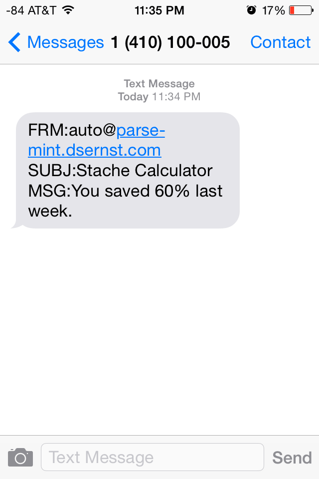

# stache-calculator

#### Convert [Mint](http://mint.com) reports into an automatic text message with your weekly savings percentage, based on [The Shockingly Simple Math Behind Early Retirement](http://www.mrmoneymustache.com/2012/01/13/the-shockingly-simple-math-behind-early-retirement).

## How it works

0. Sign up for Mint and link the financial accounts you want to track.
1. Enable the weekly email reports.
2. Set up a Gmail filter to auto-forward these reports to [auto@stache.dsernst.com](mailto:auto@stache.dsernst.com)
  - The first time, you'll need to add your phone number.

Now you'll automatically receive notifications by text message.

## Getting Started

Write me at [stache-calculator@dsernst.com](mailto:stache-calculator@dsernst.com) if you're interested in starting.
